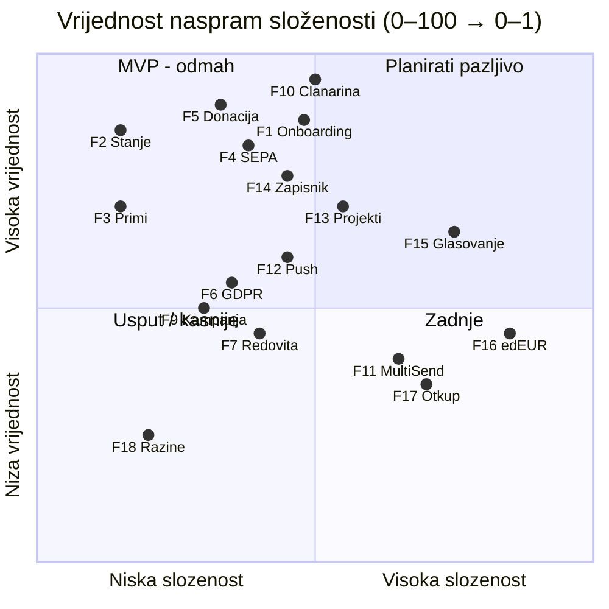
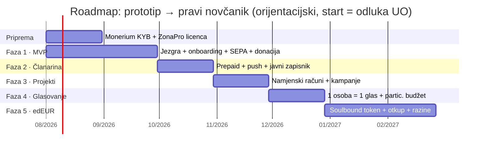

# Roadmap razvoja — od prototipa do pravog novčanika

Iterativna podjela funkcionalnosti prototipa u faze isporuke. Svaka faza je
**samostalna, upotrebljiva cjelina** koja se pušta korisnicima (mjesečni ritam),
po načelu: **prvo ono što je najjednostavnije, a donosi najveću vrijednost.**

> **Pretpostavka složenosti:** razvoj kreće od funkcionalne jezgre iz
> `pay.domovina.ai/wallet` (passkey + Safe + EURe transfer + Monerium SEPA most),
> po planu ekstrakcije iz `CLAUDE.md` (git submodule, intents preko
> `mpt.domovina.ai`). Ono što jezgra već ima = integracija (jeftino); ono čega
> nema = novi razvoj (skupo). Bez te jezgre sve ocjene složenosti rastu za
> 30–40 bodova i roadmap se produljuje za ~2 mjeseca.

---

## 1. Metodologija bodovanja (0–100)

Svaka funkcionalnost ocijenjena je na dvije osi:

**Vrijednost (V, 0–100)** — koliko rješava stvarni problem člana i udruge.
Ponderirano iz četiri kriterija:

| Kriterij | Udio | Pitanje |
|---|---|---|
| Novčani tok | 35 % | Donosi li udruzi prihod ili štedi naknade? |
| Korist za člana | 30 % | Rješava li članu konkretan zadatak (platiti, donirati, provjeriti)? |
| Povjerenje i transparentnost | 20 % | Jača li #1 brand vrijednost — javni, auditabilni tok novca? |
| Engagement | 15 % | Vraća li člana u aplikaciju i veže li ga uz zajednicu? |

**Složenost (S, 0–100)** — trošak da funkcionalnost radi *u produkciji* (ne u mocku):

| Raspon | Značenje |
|---|---|
| 0–20 | Gotovo u prototipu ili čista statika/frontend — dani |
| 21–45 | Jezgra pokriva; posao je integracija, brendiranje, tanki backend — 1–2 tjedna |
| 46–65 | Novi backend podsustav (indeksiranje, push, registar) — 2–4 tjedna |
| 66–100 | Novi pametni ugovor, novi identitetski podsustav ili pravna provjera — mjesec+ |

**Prioritet Δ = V − S.** Pozitivan Δ znači „vrijednost premašuje trošak" — što
veći Δ, to ranije u roadmapu. Negativan Δ ne znači „ne raditi", nego „raditi
kasnije, kad prethodne faze podignu vrijednost" (npr. glasovanje vrijedi više
kad postoje projekti o kojima se glasa).

---

## 2. Ocjene svih funkcionalnosti

Sortirano po prioritetu Δ. Stupac „zašto" sažima obrazloženje obje ocjene.

| # | Funkcionalnost | V | S | Δ | Zašto ovakve ocjene |
|---|---|--:|--:|--:|---|
| F2 | Stanje EURe + pregled računa | 85 | 15 | **+70** | Bez stanja nema novčanika (V); jezgra već čita onchain, čisti UI posao (S). |
| F3 | Primi: QR / adresa (EIP-681) | 70 | 15 | **+55** | Osnovna novčanička higijena — svaki član je mora imati (V); jezgra ima EIP-681, samo brendirati (S). |
| F5 | Jednokratna donacija | 90 | 40 | **+50** | Glavni tok prihoda, 0 % provizije naspram 1,5 % + 0,25 € kartice (V); jezgra ima transfer, treba intent na `mpt.domovina.ai` + relay (S). |
| F10 | Prepaid članarina | 95 | 50 | **+45** | Najveća vrijednost od svih: core business udruge, killer-argument 1 €/tjedno bez fiksne bankovne naknade 0,25–0,40 € po nalogu (V); nema novog ugovora, ali treba izračun razdoblja unatrag/unaprijed i prepaid UX (S). |
| F1 | Onboarding passkey + Safe | 90 | 45 | **+45** | Preduvjet svega; bez seeda i lozinki = pristupačno građanima (V); jezgra ima passkey/Safe, posao je submodule spajanje + parametrizacija branda u `passkey.ts`/`paperWallet.ts` (S). |
| F4 | SEPA nadoplata (Monerium) | 85 | 40 | **+45** | Most iz banke — bez njega novčanik nema čime raditi (V); jezgra ima Monerium most, treba IBAN onboarding tok (S). |
| F14 | Aktivnost: javni zapisnik | 80 | 45 | **+35** | Transparentnost je razlog povjerenja i članstva (V); onchain `getLogs` je poznat obrazac, ali treba registar pseudonima (S). |
| F19 | PWA instalacija + splash | 40 | 5 | **+35** | Kanal distribucije bez app storea (V); već gotovo u prototipu (S). |
| F20 | Dokumenti + dijagrami | 35 | 5 | **+30** | Povjerenje UO-a i transparentnost odluka (V); već gotovo (S). |
| F8 | Usporedba naknada | 30 | 5 | **+25** | Edukacijski argument „zašto onchain" (V); čista statika, već napisana (S). |
| F6 | GDPR opt-in javnog imena | 55 | 35 | **+20** | Pravno nužno čim je zapisnik javan; malen UX doseg (V); mali backend registar privola (S). |
| F9 | Kampanja zajednice s ciljem | 50 | 30 | **+20** | Pojačava donacije, sezonski vrhovi (V); agregat nad postojećim namjenskim Safeom + brojač (S). |
| F12 | Push podsjetnik za re-up | 60 | 45 | **+15** | Bez njega prepaid model curi — zaboravljeni re-up = izgubljeni prihod (V); web-push infra: service worker + backend scheduler (S). |
| F13 | Projekti / namjenski računi | 70 | 55 | **+15** | Participativni budžet — diferencijator prema klasičnim udrugama (V); deploy N Safe-ova + indeksiranje raised/goal (S). |
| F18 | Razine članstva | 25 | 20 | **+5** | Čista gamifikacija — bez kritične mase korisnika nema učinka (V); izvedeno iz povijesti uplata, frontend (S). |
| F7 | Redovita donacija | 45 | 40 | **+5** | Nice-to-have povrh jednokratne; self-custody ionako traži potvrdu svaki put (V); spremljeni intent + podsjetnik (S). |
| F15 | Glasovanje 1 osoba = 1 glas | 65 | 75 | **−10** | Jak engagement i slogan, ali nije novčani tok (V); anti-sybil identitet, members-only gating i javni tally = novi podsustav (S). |
| F11 | MultiSend raspodjela | 40 | 65 | **−25** | Elegancija za power-usere; jedan račun dovoljan za start (V); kompozicija atomične transakcije + UX raspodjele (S). |
| F17 | Otkup edEUR → EURe | 35 | 70 | **−35** | Ima smisla tek kad edEUR živi i ima kritičnu masu (V); fond za isplate + diskrecijski proces UO (S). |
| F16 | edEUR soulbound token | 45 | 85 | **−40** | Motivacija volontera — dugoročno važna, kratkoročno ne (V); novi ERC-20 bez transfera, mint/burn governance, pravna provjera MiCA granice (S). |

### Vizualno: matrica vrijednost × složenost

**Čitanje matrice:** gornji-lijevi kvadrant (visoka vrijednost, niska složenost)
je MVP; gornji-desni se planira pažljivo (članarina, projekti); donji-desni
(edEUR, otkup) ide zadnji; donji-lijevi (razine, usporedba naknada) se pokupi
usput uz srodne faze.

---

## 3. Faze isporuke — detaljna razrada

Svaka faza ima: priču (kako se komunicira članstvu), sadržaj s ocjenama,
obrazloženje redoslijeda, ovisnosti, glavne rizike i mjerljiv izlazni kriterij.

### Faza 1 · MVP „Pravi novčanik" (mjesec 1–2) — prosječni Δ +48

> **Priča za članstvo:** „Instalirajte, stvorite novčanik otiskom prsta,
> nadoplatite iz banke i donirajte udruzi — bez ijedne naknade."

**Sadržaj:** F1 onboarding (Δ+45) · F2 stanje (Δ+70) · F3 Primi (Δ+55) ·
F4 SEPA (Δ+45) · F5 donacija u Opći fond (Δ+50) · F8, F19, F20 prenose se gotovi.

**Zašto ova faza prva:** to je najmanji skup koji čini *upotrebljiv proizvod* —
novčanik koji prima novac iz banke i šalje ga udruzi. Svaka od pet
funkcionalnosti je u top 6 po prioritetu Δ. Ništa iz kasnijih faza ne radi bez
ove (sve ovisi o F1/F2).

**Tehnički opseg:** spajanje jezgre kao git submodule; parametrizacija
`brand.*` u `passkey.ts` i `paperWallet.ts`; intents na dijeljeni
`mpt.domovina.ai` (CORS); vlastiti `/api/relay` kao same-origin Pages Function
(pay.domovina.ai ADR 0015); jedan namjenski Safe („Opći fond").

**Ovisnosti:** Monerium onboarding udruge (IBAN ↔ EURe most) — pokrenuti
odmah, vodi vrijeme neovisno o kodu. ZonaPro web-embedding licenca —
potvrditi prije javnog launcha.

**Rizici:** (1) ekstrakcija jezgre otkrije skrivene brand-ovisnosti → držati se
plana iz CLAUDE.md, mijenjati samo `passkey.ts`/`paperWallet.ts`; (2) Monerium
KYB proces udruge potraje → počne li kasniti, MVP izlazi s QR-primanjem (F3)
kao jedinim ulazom novca, SEPA se dodaje naknadno.

**Izlazni kriterij:** stvarna EURe donacija stvarnog člana, end-to-end
(banka → SEPA → EURe → donacija → javno vidljivo), na produkciji.

### Faza 2 · „Članarina + transparentnost" (mjesec 3) — prosječni Δ +29

> **Priča za članstvo:** „Podmirite članarinu za cijelu godinu jednim otiskom —
> i vidite svaki euro udruge javno."

**Sadržaj:** F10 prepaid članarina (Δ+45) · F12 push podsjetnik (Δ+15) ·
F14 javni zapisnik (Δ+35) · F6 GDPR opt-in imena (Δ+20).

**Zašto sad:** F10 je pojedinačno najvrjednija funkcionalnost (V=95) — čim
novčanik postoji, članarina je prvi razlog da ga *svaki* član koristi, ne samo
donatori. F12 ide u paketu jer prepaid bez podsjetnika curi (nema auto-debita,
član mora sam obnoviti). F14+F6 idu zajedno jer javni zapisnik bez GDPR
registra privola nije pravno ispravan.

**Tehnički opseg:** izračun razdoblja (unatrag + unaprijed, `plural()` logika
već u prototipu); kategorije redovni/UO; web-push (service worker postoji za
PWA, dodaje se subscription backend + scheduler); `getLogs` indeksiranje +
registar pseudonima s opt-in privolama.

**Rizici:** push na iOS PWA zahtijeva instalaciju s home screena (iOS 16.4+) —
komunicirati instalaciju kao preduvjet; fallback je e-mail podsjetnik.

**Izlazni kriterij:** ≥ 10 stvarnih članova plaća članarinu kroz aplikaciju;
javni zapisnik dostupan svima bez prijave.

### Faza 3 · „Projekti i kampanje" (mjesec 4) — prosječni Δ +4

> **Priča za članstvo:** „Vi odlučujete kamo ide vaš novac — interni
> crowdfunding udruge."

**Sadržaj:** F13 namjenski računi (Δ+15) · F9 kampanja s ciljem (Δ+20) ·
F7 redovita donacija (Δ+5) · F11 MultiSend raspodjela (Δ−25, *stretch* —
prelijeva se u fazu 4 ako ne stane).

**Zašto sad:** projekti pretvaraju novčanik iz „blagajne" u participativni
alat — diferencijator prema svakoj klasičnoj udruzi. Δ je niži, ali vrijednost
raste tek kad postoji baza platiša iz faze 2 (bez korisnika nema smisla dijeliti
tokove na N računa). Kampanja (F9) je jeftina nadgradnja i daje marketinški
moment za objavu faze.

**Tehnički opseg:** deploy zasebnog Safea po projektu; indeksiranje
raised/goal/broj doprinositelja; kampanja = agregat + brojač nad postojećim
Safeom (Agora); MultiSend kompozicija (jedna potvrda, N transfera) — obrazac
već postoji u jezgri za deploy+transfer.

**Rizici:** proliferacija Safe-ova (svaki košta deploy gas) → projekte otvara
samo UO, počinje se s postojeća 4 iz prototipa.

**Izlazni kriterij:** ≥ 2 aktivna projekta s javnim brojačima; ≥ 1 donacija
usmjerena na projekt po izboru donatora.

### Faza 4 · „Glasovanje" (mjesec 5) — Δ −10, ali s podlogom iz faza 1–3

> **Priča za članstvo:** „Vaš glas. Vaša odluka." — 1 osoba = 1 glas, javno provjerljivo.

**Sadržaj:** F15 glasovanje (Δ−10) · dovršetak F11 ako je ostao iz faze 3.

**Zašto sad, a ne ranije:** sirovi Δ je negativan, ali ocjena V=65 vrijedi za
izolirano glasovanje. Nakon faza 1–3 vrijednost skače: anti-sybil se dobiva
*besplatno* (passkey identitet iz F1 + status članarine iz F10 = dokaz
članstva), a participativni budžet ima o čemu glasati (projekti iz F3). To je
razlog zašto se složena funkcionalnost gradi zadnja u nizu, na gotovim
primitivima — a ne prva, kad bi svaki dio morala graditi sama.

**Tehnički opseg:** ankete (members-only gating preko statusa članarine);
javni tally; edEUR nagrada za sudjelovanje ostaje mock do faze 5 (u prototipu
je već tako označena).

**Rizici:** onchain glas po glasu = gas i UX trošak → za savjetodavne ankete
prihvatljiv je potpisani glas (passkey signature) + javna objava rezultata s
dokazima; puni onchain tally tek ako se pokaže potreba. Formalne odluke ionako
donose Skupština i UO (glasovanje je savjetodavni signal).

**Izlazni kriterij:** prva stvarna članska anketa provedena kroz aplikaciju,
rezultat javno objavljen i provjerljiv.

### Faza 5 · „edEUR nagrade" (mjesec 6–7) — Δ −38, svjesno zadnja

> **Priča za članstvo:** „Vaš rad za zajednicu se vidi i vrijedi."

**Sadržaj:** F16 edEUR soulbound + log rada (Δ−40) · F17 otkup edEUR→EURe
(Δ−35) · F18 razine članstva (Δ+5, jeftin dodatak koji ima smisla tek uz edEUR).

**Zašto zadnja:** najveća složenost (novi ugovor + pravna provjera) uz
vrijednost koja ovisi o kritičnoj masi aktivnosti — edEUR nagrađuje rad
(moderiranje, prijevodi, sjednice), a rada ima tek kad zajednica živi u
aplikaciji (faze 2–4). Graditi je ranije značilo bi mintanje tokena koje nitko
ne zarađuje.

**Tehnički opseg:** neprenosivi ERC-20 (mint samo udruga, burn pri otkupu,
bez P2P → izvan MiCA EMT/EMI okvira — detalji u
`docs/compliance/edeur-loyalty-token.md`); fond za isplate s diskrecijskim
otkupom (ne zajamčeni claim — to je granica koja ga drži izvan EMT-a); razine
izvedene iz povijesti uplata i edEUR loga.

**Kapije (obavezne prije starta):** pisana pravna potvrda MiCA granice;
odluka UO o pravilniku nagrađivanja (tko, za što, koliko edEUR). Zastavica
`isEMILicenseActive` (P2P prijenos) ostaje **izvan ovog roadmapa** — mijenja je
samo UO Safe multisig, tek uz EMI licencu.

**Izlazni kriterij:** prvi edEUR mintan za stvarni volonterski rad; jedan
diskrecijski otkup edEUR→EURe proveden kroz fond za isplate.

---

## 4. Kronološki prikaz

Orijentacijski kalendar (ako start ~kolovoz 2026): **MVP u listopadu**,
članarina u studenom, projekti u prosincu, glasovanje u siječnju, **edEUR u
ožujku 2027**. Datumi su prijedlog — pomiču se s odlukom UO i stvarnim
kapacitetom razvoja; fiksan je *redoslijed*, ne kalendar.

## 5. Načela između faza

1. **Svaka faza završava deployem na produkciju** i objavom članstvu — nema
   „velikog praska" na kraju. Faza koja kasni se reže (stretch stavke poput
   F11 prelijevaju se dalje), ne produljuje.
2. **Prototip ostaje živ** (edw-prototip.domovina.ai) kao dizajnerski poligon —
   nove ideje se prvo iteriraju u mocku, pa tek onda ulaze u roadmap.
3. **Feedback widget** prenosi se u pravu aplikaciju od faze 1 — ocjene V se
   revidiraju nakon svake faze prema stvarnim komentarima članova; roadmap je
   živ dokument.
4. **Ne preskakati compliance kapije:** ZonaPro web-licenca prije faze 1;
   GDPR registar privola prije javnog zapisnika (faza 2); pravna potvrda edEUR
   granice prije faze 5; P2P (`isEMILicenseActive`) izvan roadmapa dok ne
   postoji EMI licenca i odluka UO multisiga.
