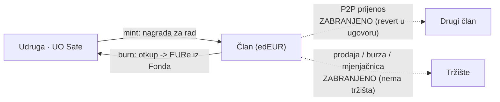
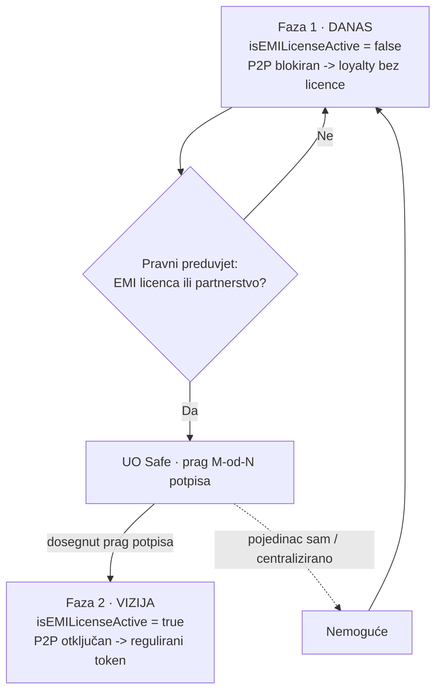

# Pravno-tehnička bilješka: edEUR — interni token lojalnosti udruge e-Demokracija

**Predmet:** Pravna klasifikacija tokena `edEUR` kao instrumenta zatvorenog kruga lojalnosti (potvrda rada za udrugu), bez potrebe za EMI licencom u Fazi 1.
**Status:** Faza 1 — *Closed-Loop Loyalty* (zatvoreni krug, bez P2P).
**Verzija:** nacrt 0.1 · 2026-06-16
**Autor:** interni nacrt (proizvodni tim)

> ⚠️ **Disclaimer.** Ovo je interna radna analiza, **ne pravni savjet**. Klasifikacija tokena ovisi o konačnoj prosudbi nadležnih tijela (HNB za e-novac/platne usluge, HANFA za financijske instrumente) i mora ju potvrditi odvjetnik specijaliziran za fintech/MiCA prije javnog lansiranja. Dokument služi kao temelj za tu provjeru i za usklađivanje koda s pravnim okvirom.

---

## 1. Sažetak

`edEUR` je interni digitalni token koji udruga e-Demokracija izdaje **kao potvrdu rada** člana za udrugu (volonterski/operativni doprinos — "30 min tjedno" strana aktivnog članstva). Token je vezan uz euro u omjeru 1:1 isključivo kao **obračunska jedinica nagrade**, a ne kao sredstvo plaćanja.

U Fazi 1 `edEUR` **pravno ne predstavlja elektronički novac (EMT/e-money) niti financijski instrument**, jer je programski i pravno postavljen unutar **izuzeća za ograničenu mrežu** (*Limited Network Exclusion*, PSD2 / Zakon o platnom prometu / Zakon o elektroničkom novcu) i izvan dosega **MiCA** (Uredba (EU) 2023/1114) za tokene e-novca. Temeljni štit je **potpuna zabrana P2P prijenosa u pametnom ugovoru**.

Arhitektura je namjerno pripremljena za **Fazu 2**: jednom kad (i ako) udruga ishodi EMI licencu ili sklopi partnerstvo s licenciranim izdavateljem e-novca, conditional flag u ugovoru otključava P2P i `edEUR` se može transformirati u regulirani token vezan uz euro.

---

## 2. Model tokena (kako edEUR funkcionira)

| Svojstvo | Opis |
|---|---|
| **Izdavanje (mint)** | Isključivo udruga (treasury Safe) mintsa `edEUR` na novčanik člana kao potvrdu obavljenog rada. Token se **ne kupuje** za novac. |
| **Prijenos** | **Onemogućen** (soulbound). Član A ne može poslati `edEUR` članu B. `transfer`/`transferFrom` revertaju za sve osim odobrenih tokova (mint, burn). |
| **Otkup (burn → isplata)** | Član može `edEUR` zamijeniti za `EURe` iz **"fonda za isplate"** udruge — **diskrecijski, ovisno o dostupnosti sredstava**. Otkup spali (burn) `edEUR` i udruga isplati EURe. |
| **Vrijednost** | Fiksno 1 `edEUR` = 1 € obračunske vrijednosti. Nema sekundarnog tržišta, ne kotira na mjenjačnicama, ne može narasti iznad nominale. |
| **Sekundarno tržište** | Ne postoji. Nema burze, nema P2P, nema špekulacije. |

### Zatvoreni krug — dopušteni i zabranjeni tokovi



---

## 3. Zašto edEUR (Faza 1) NIJE elektronički novac

### Korak 1 — Zabrana P2P prijenosa u kodu (temeljni štit)

Da bi token bio "novac" ili "valuta", mora služiti kao **opće sredstvo razmjene**. U pametnom ugovoru `edEUR` funkcije `transfer` i `transferFrom` su zaključane:

- **Član A ne može poslati `edEUR` članu B.**
- Token se kreće isključivo: (a) **udruga → član** (mint, kao nagrada za rad), i (b) **član → udruga** (burn, pri otkupu za EURe).

**Pravni učinak:** bez P2P prometa token gubi svojstvo općeg platnog sredstva. Pravno prestaje biti novac i postaje **namjenska potvrda doprinosa / interni vaučer**.

### Korak 2 — Izuzeće za ograničenu mrežu (*Limited Network Exclusion*)

PSD2 (i Zakon o platnom prometu / Zakon o elektroničkom novcu RH) izuzimaju instrumente koji se koriste **unutar ograničene mreže** ili za **ograničen spektar roba/usluga**.

- `edEUR` se koristi unutar jedne zatvorene mreže — **jedne udruge i njezinih odobrenih namjena** (otkup iz fonda udruge).
- Ne služi za kupnju robe/usluga na otvorenom tržištu.

**Pravni učinak:** isti pravni status kao bodovi lojalnosti zatvorenog kruga (MultiPlusCard, DM Active Beauty, interni vaučeri). Za izdavanje takvih bodova ne treba licenca središnje banke.

### Korak 3 — Status prema MiCA (EU 2023/1114)

MiCA strogo regulira **tokene e-novca (EMT)** — tokene koji stabiliziraju vrijednost referenciranjem na službenu valutu i namijenjeni su kao sredstvo razmjene. Ključno za `edEUR`:

- `edEUR` se **ne može slobodno prenositi** izvan odobrenih tokova izdavatelja i **nema sekundarno tržište** → ne djeluje kao sredstvo razmjene namijenjeno javnosti.
- Ne nudi se javnosti radi kupnje niti se uvrštava na platforme za trgovanje.

**Pravni učinak:** budući da nije prenosiv i nema tržište, izostaju ključna obilježja EMT-a; token ostaje u zoni internog programa lojalnosti.

> **Napomena o preciznosti (ispravak čestog miješanja pojmova):** osnova za izuzeće je **ne-prenosivost + ograničena mreža + nepostojanje sekundarnog tržišta**, a **ne** "jedinstvenost/nezamjenjivost" (NFT). `edEUR` jest fungibilan (1 = 1 €), ali je **soulbound** — i to ga, uz zatvoreni krug, drži izvan EMT okvira. Argument se mora graditi na ne-prenosivosti, ne na NFT-svojstvu.

### Korak 4 — Zašto NIJE financijski instrument (HANFA)

Da bi token bio *security*, kupuje se s očekivanjem profita iz truda treće strane.

- `edEUR` ima **fiksnu vrijednost 1:1** prema euru; ne može narasti.
- Nema dividende, prinosa, špekulacije ni trgovanja. Dodjeljuje se za **rad**, ne kao investicija.

**Pravni učinak:** nema obilježja financijskog instrumenta → izvan nadležnosti HANFA-e.

### Korak 5 — Tokovi stvarnog novca (kako se izbjegava status primatelja depozita)

`edEUR` se **ne kupuje** za novac (nema priljeva novca od članova u zamjenu za token), pa udruga ne prima "pologe":

1. **Izdavanje:** udruga mintsa `edEUR` za **obavljeni rad** — to je priznanje doprinosa, ne prodaja tokena.
2. **Otkup:** kad član želi unovčiti `edEUR`, udruga ih spali i isplati **EURe iz vlastitog "fonda za isplate"** (proračunska stavka udruge), **ovisno o dostupnosti**. To je isplata nagrade, ne *withdrawal* s burze.

> **Osjetljiva točka (load-bearing):** otkup mora biti formuliran kao **diskrecijska nagrada ovisna o dostupnosti fonda**, a **ne** kao **zajamčeni 1:1 claim na zahtjev**. Zajamčeni otkup na zahtjev približava token definiciji potraživanja/e-novca. Ovo je granica koju treba pažljivo držati i u kodu i u uvjetima korištenja.

---

## 4. Terminologija (kako predstavljati edEUR)

Radi izbjegavanja nepotrebnih regulatornih "crvenih alarma", u službenoj komunikaciji i dokumentaciji:

- **IZBJEGAVATI:** *kriptovaluta, stablecoin, digitalni novac, platni promet, investicija, isplata na zahtjev.*
- **KORISTITI:** *interni program lojalnosti, potvrda rada/doprinosa, bodovi zajednice, nagrada za volonterski rad, namjenski vaučer.*

(U korisničkom sučelju novčanika već se koristi formulacija "potvrda rada", "ne-prenosivo", "zamjena iz fonda za isplate, ovisno o dostupnosti".)

---

## 5. Faza 2 — conditional flag: od lojalnosti do reguliranog tokena

Pametni ugovor je pripremljen s "prekidačem" koji razdvaja *loyalty* režim od reguliranog režima:

```solidity
bool public isEMILicenseActive = false; // Faza 1: P2P blokiran

// u _update / _beforeTokenTransfer:
// ako !isEMILicenseActive -> dopušteni su samo mint (from == 0)
//                            i burn/otkup (to == treasury) ; sve ostalo revert.
// ako  isEMILicenseActive -> standardni ERC-20 prijenosi (P2P) dopušteni.
```

- **Faza 1 (`false`):** kod prisilno blokira P2P → siguran *loyalty* status bez licence.
- **Faza 2 (`true`):** tek **nakon** ishođenja EMI licence (ili partnerstva s licenciranim izdavateljem e-novca) flag se prebacuje; P2P se otključava i `edEUR` postaje regulirani token vezan uz euro.

**Važno:** sam flag **ne stvara** pravo na P2P — pravni temelj je licenca/partnerstvo. Flag je samo tehnička poluga koja se aktivira **kad i ako** pravni preduvjeti budu ispunjeni. Prebacivanje flaga bez licence ne bi bilo usklađeno.

**Tko može prebaciti zastavicu (decentralizacija):** nijedan pojedinac. Zastavicu mijenja isključivo Upravni odbor kroz Safe s višestrukim potpisom (prag M-od-N), i to tek nakon ispunjenja pravnog preduvjeta.



---

## 6. Load-bearing ograničenja (što se NE smije narušiti u Fazi 1)

1. **Nema P2P.** `transfer`/`transferFrom` između članova moraju revertati na razini ugovora (ne samo u UI-u).
2. **Otkup je diskrecijski**, ovisan o dostupnosti fonda — ne zajamčeni claim na zahtjev.
3. **Nema sekundarnog tržišta** — token se ne uvrštava na burze/mjenjačnice, nema likvidnosnih pulova.
4. **edEUR se ne prodaje** za novac — samo se mintsa za rad/doprinos.
5. **Terminologija** dosljedno "loyalty/vaučer", ne "stablecoin/novac".

Narušavanje bilo koje točke gura `edEUR` prema klasifikaciji EMT-a (→ EMI licenca/autorizacija).

---

## 7. Odnos prema EURe (Monerium) na strani otkupa

Fond za isplate drži **EURe** (Monerium EUR e-money token na Gnosisu). Otkup `edEUR → EURe` je isplata udruge u već-reguliranom e-novcu (EURe izdaje licencirani EMI Monerium). Treba provjeriti:

- da isplata EURe iz fonda udruge ne ulazi u "hold-and-forward" obrazac koji Monerium BToS ograničava (vidi compliance SSOT `pay.domovina.ai/docs/compliance` i bilješku o Monerium BToS §16);
- da je fond udruge tehnički Safe pod kontrolom udruge, a isplata = obična EURe transakcija.

---

## 8. Preporuke / sljedeći koraci

1. **Pravna potvrda:** dati ovu bilješku odvjetniku (fintech/MiCA) i, po potrebi, neformalno provjeriti s HNB-om status "ograničene mreže".
2. **Uskladiti kod s tezom:** osigurati da ne-prenosivost i diskrecijski otkup budu *enforced* u Solidityju (ne samo u prototipu/UI-u).
3. **Uvjeti korištenja (ToS):** napisati uvjete `edEUR` programa koji jasno opisuju: potvrda rada, ne-prenosivost, otkup ovisan o dostupnosti fonda.
4. **Registar mintova:** voditi auditabilan zapis "rad → mint" radi transparentnosti (usklađeno s vrijednošću transparentnosti udruge).
5. **Tek po licenci** razmotriti Fazu 2 (`isEMILicenseActive = true`).

---

## Reference

- Uredba (EU) 2023/1114 (**MiCA**) — osobito odredbe o tokenima e-novca (EMT) i izuzeća (čl. 2).
- Direktiva (EU) 2015/2366 (**PSD2**) — izuzeće za ograničenu mrežu.
- Zakon o elektroničkom novcu (RH), Zakon o platnom prometu (RH).
- Interni compliance SSOT: `pay.domovina.ai/docs/compliance/` (provider model, Monerium BToS).
- Izvorni pravno-tehnički pregled (loyalty → EMI flag arhitektura), interni dokument.

*Kraj nacrta. Sve tvrdnje podložne pravnoj potvrdi prije lansiranja.*
