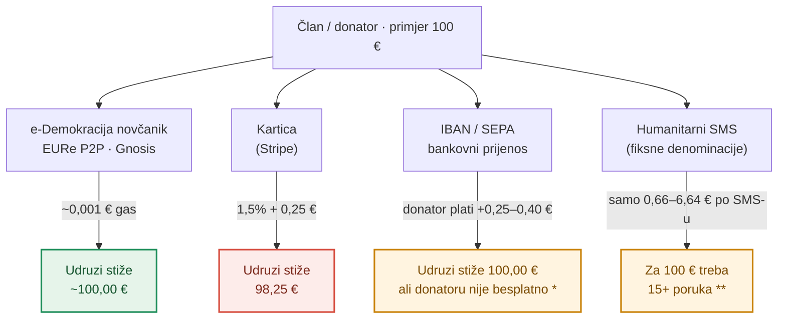
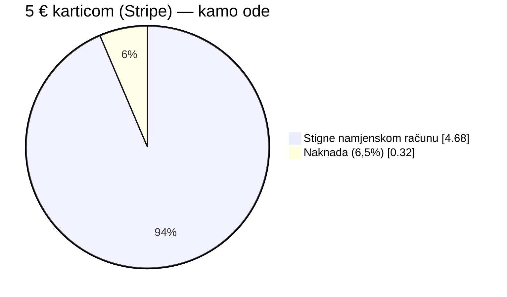
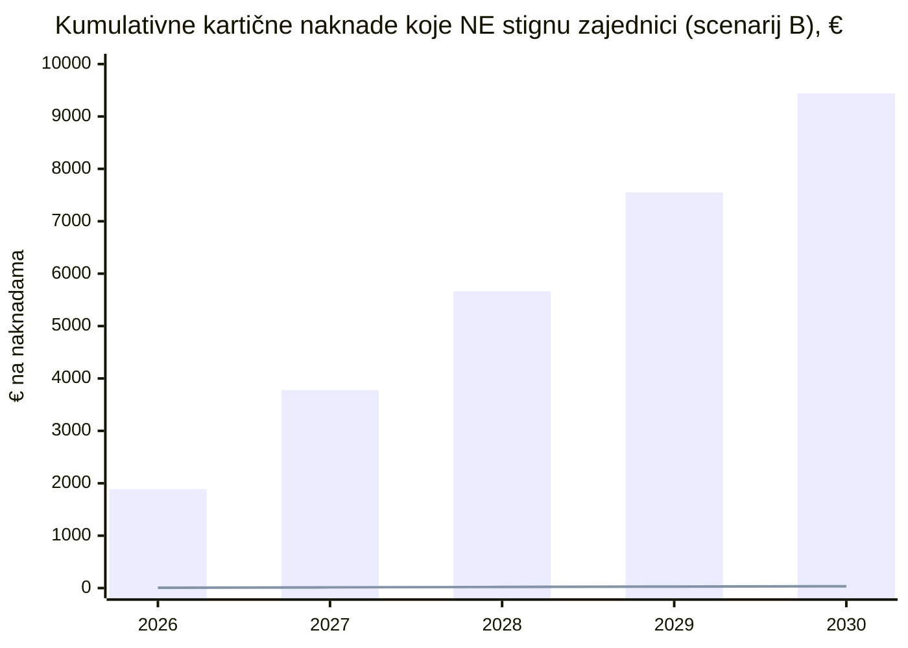
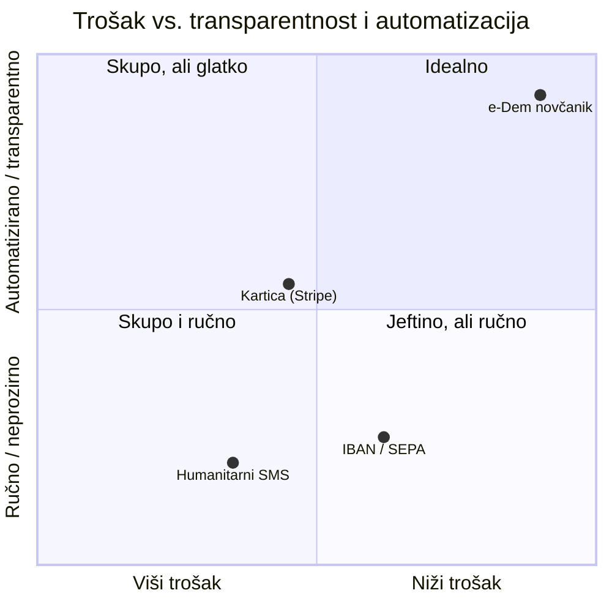

# Isplativost — e-Demokracija novčanik vs. ostali kanali uplata

**Izdavatelj:** Udruga e-Demokracija · OIB: 70011366813 · Remete 52, 10000 Zagreb
**Verzija:** nacrt 0.1 · **Datum:** 10. srpnja 2026.

> ⚠️ **Disclaimer.** Ovo je interna radna analiza isplativosti, **ne financijski ni pravni savjet**. Stope naknada vrijede na dan izrade (Stripe EEA, HR banke — srpanj 2026.) i mogu se promijeniti. **Iznosi u projekcijama su ILUSTRATIVNI** — odabrani volumeni za prikaz reda veličine, ne stvarni podaci Udruge.

---

## 1. Ideja: novčanik ne zamjenjuje kanale, nego ih nadopunjuje

Udruga danas prima donacije i članarine klasično — **uplatom na IBAN**. Uz to bi web donacije mogle ići **karticom** (npr. Stripe), a za šire akcije postoji i **humanitarni SMS**. Svaki kanal ima svoje mjesto.

**e-Demokracija novčanik** dolazi kao **četvrti, zadano preporučeni kanal** — EURe stablecoin transfer izravno s novčanika člana na namjenski Safe račun Udruge. Nije prisila: tko želi uplatnicu, i dalje je koristi. Ali za sve koji mogu platiti u EURe, novčanik je **najjeftiniji i najtransparentniji** put — pogotovo za **male, česte uplate**, a upravo je to model Udruge: **članarina 1 € tjedno** (Statut čl. 11), UO **3 € dnevno**.

Ključna razlika je gdje „curi" novac: fiksne naknade i postoci koje uzmu posrednici jesu novac koji **ne stigne zajednici**.

\* **Primatelj** doista dobije 100%, ali **pošiljatelj** kod hrvatskih banaka plaća **fiksnu naknadu po nalogu (~0,25–0,40 €)** — pa mu mala uplata nije isplativa (vidi §3.1). Uz to je IBAN **ručan** (bez recurringa, spor uvid); za **prekogranične** uplate iz dijaspore SWIFT izvan SEPA-e naplaćuje **5–30 € fiksno** + tečajnu razliku.
\*\* Humanitarni SMS radi samo u **fiksnim denominacijama** i samo za **domaće pretplatnike**; traži posebno odobrenu akciju, bez recurringa i bez javnog uvida po donatoru. Za trajni članski model Udruge nije praktičan kao stalni kanal.

---

## 2. Naknade po kanalu (EU donator)

| Kanal | Naknada po uplati | Na 1 € (tjedna članarina) | Na 5 € | Na 100 € |
|---|---|---|---|---|
| **e-Dem novčanik** (EURe/Gnosis) | ~0,001 € (gas) | **~0%** | **~0%** | **~0%** |
| **Kartica** (Stripe EEA) | 1,5% + 0,25 € | 0,27 € · **27%** | 0,33 € · **6,5%** | 1,75 € · 1,75% |
| **IBAN / SEPA** (HR banke) | 0,25–0,40 € po nalogu — **plaća donator** \* | do 0,40 € · **do 40%** \* | do 0,40 € · **do 8%** \* | 0,40 € · 0,4% \* |
| **Humanitarni SMS** | fiksne denominacije, posebna akcija \*\* | ne postoji 1 € opcija svugdje | ✓ (uz ograničenja) | ~15 poruka |

\* Udruzi stigne 100%, ali **donator** kod hrvatskih banaka (ZABA, PBZ, Erste, OTP, HPB) plaća **fiksni nalog ~0,25–0,40 €** (ovisno o paketu/kanalu). Taj fiksni iznos „pojede" male uplate jednako kao kartica — samo na strani **pošiljatelja**.
\*\* SMS akcije se odobravaju pojedinačno, denominacije su fiksne, dostupno samo domaćim pretplatnicima, bez recurringa; uvjeti ovise o operateru i akciji.

**Zaključak reda veličine:** fiksni dio naknade — bilo kartične (0,25 €), bilo bankovne (0,25–0,40 €) — **ubija mikrouplate**. Kod e-Demokracije je to posebno bolno jer je model upravo mikrouplata: **redovni član 1 € tjedno, UO 3 € dnevno** (Statut čl. 11). Preko banke bi donatora tjedna članarina koštala **25–40% pride**; jedino onchain transfer nema fiksni dio ni na jednoj strani.

---

## 3. Mikrouplata: gdje curi novac

Za donaciju od **5 €** karticom, od svakog eura dio ode procesoru. Kod novčanika ne ode ništa.

Naizgled sitnica — ali na **tisućama** malih uplata (tjedne članarine članstva, mikrodonacije za platformu Agora) taj postotak postaje ozbiljan novac koji je mogao ići u razvoj digitalne demokracije.

### 3.1 Hrvatsko tržište: SEPA **nije** besplatan kao Revolut

Čest prigovor je: „pa IBAN je besplatan, čemu novčanik?". To vrijedi za **primatelja** — Udruga doista dobije 100%. Ali **pošiljatelja** klasične hrvatske banke naplaćuju: **ZABA, PBZ, Erste, OTP, HPB** tipično uzimaju **fiksni nalog ~0,25–0,40 € po transakciji** (ovisno o paketu i kanalu). Za razliku od npr. **Revoluta**, gdje je SEPA prijenos besplatan — pa poslati 1,00 € nikoga ništa ne košta — na hrvatskim bankama **svaka mala uplata donatoru je gubitak**.

Zato član neće slati 1–5 €: nije mu isplativo platiti nalog da bi uplatio sitan iznos. Efekt je isti kao kod kartice, samo trošak snosi **pošiljatelj**:

| Član šalje | HR banka (nalog ~0,40 €) | e-Dem novčanik (gas ~0,001 €) |
|---|---|---|
| **1 €** (tjedna članarina) | trošak **~40%** | ~0% |
| **3 €** (dnevna UO članarina) | trošak **~13%** | ~0% |
| **5 €** | trošak **~8%** | ~0% |
| **100 €** | trošak ~0,4% | ~0% |

Novčanik je jedini kanal **bez fiksne naknade ni na jednoj strani** — pa članarina od 1 € tjedno i mikrodonacija za Agoru imaju smisla. Na hrvatskom tržištu, gdje je fiksni bankovni nalog pravilo a ne iznimka, ova inovacija ima **još više** smisla.

---

## 4. Projekcije kroz godine

Pretpostavimo tri ilustrativna godišnja scenarija i usporedimo **karticu** (glavni plaćeni kanal) s **e-Dem novčanikom**.

| Scenarij (godišnje) | Volumen | Kartica (naknade) | e-Dem novčanik | **Ušteda / god** |
|---|---|---|---|---|
| **A · Mikro-kampanja** (platforma Agora) | 2.000 × 5 € = 10.000 € | 650 € (6,5%) | ~2 € | **~648 €** |
| **B · Tjedne članarine** | 137 članova × 52 × 1 € = 7.124 € | 1.888 € (**26,5%**) | ~7 € | **~1.881 €** |
| **C · Redovite donacije + dijaspora** | 150 × 12 × 30 € = 54.000 € | ~1.560 € † | ~2 € | **~1.558 €** |

† uključuje udio međunarodnih (ne-EEA) kartica po višoj stopi (3,25% + 0,25 €) — dijaspora je prirodna publika e-demokracije, a novčanikom uplaćuje jednako jeftino kao član iz Zagreba.

Scenarij B je najdramatičniji: kod **tjedne članarine od 1 €** fiksna naknada guta **više od četvrtine** prikupljenog. Upravo zato prepaid model novčanika (jedna potvrda otiskom za N tjedana, MultiSend raspodjela) nema alternativu za ovaj use-case.

Kroz vrijeme se ušteda **akumulira**. U članarinskom scenariju (B), naknade koje **ne stignu** zajednici izgledaju ovako:

Stupci = kumulativne kartične naknade; donja linija ≈ 0 = e-Dem novčanik (samo gas). Nakon **5 godina** razlika je **~9.440 €** — više od godišnjih ciljeva namjenskih računa „Pravna analiza referenduma" (1.500 €), „Edukacija građana" (2.000 €) i „Platforma Agora" (5.000 €) **zajedno**. Novac koji je inače otišao procesoru, ostaje demokraciji.

---

## 5. Nije samo cijena — pozicioniranje kanala

Trošak je samo jedna os. Druga je **automatizacija i transparentnost** (recurring bez auto-debita, MultiSend, javni onchain uvid — vrijednost #1 Udruge). Novčanik je jedini kanal u „idealnom" kutu.

- **IBAN / SEPA** je jeftin za **veće** iznose, ali kod hrvatskih banaka ima **fiksni nalog pošiljatelju (0,25–0,40 €)** koji poskupljuje male uplate; uz to ručan i spor za uvid → donji desni kut.
- **Kartica** je glatka za donatora, ali plaćena i custodijalna (posrednik drži novac) → sredina.
- **Humanitarni SMS** traži posebno odobrenu akciju, fiksne denominacije, radi samo domaćim pretplatnicima i ne daje javni uvid → donji lijevi kut; koristan za jednokratne medijske akcije.
- **e-Dem novčanik** spaja niski trošak s automatizacijom i javnom transparentnošću → gornji desni kut.

---

## 6. Zašto je ovo inovacija koja ima smisla

1. **Mikrouplate postaju isplative.** Bez fiksne naknade, članarina od 1 € tjedno (i 3 € dnevno za UO) i donacija od 2–5 € imaju smisla — što širi bazu malih, čestih donatora (dugoročno najstabilniji izvor za neprofitnu udrugu).
2. **Recurring bez auto-debita.** Prepaid model (jedna potvrda otiskom za N tjedana, MultiSend) daje redovitost bez skrbništva nad karticom člana — u skladu sa self-custody načelom.
3. **Transparentnost = povjerenje.** Svaki euro javno je vidljiv i auditabilan onchain — član vidi da je njegova uplata stigla na namjenski račun (Agora, pravna analiza, edukacija), što kartica i IBAN ne mogu ponuditi. Za udrugu kojoj je transparentnost vrijednost #1, ovo je programska točka, ne feature.
4. **Prekogranično bez SWIFT-a.** Dijaspora šalje EURe jednako jeftino kao član iz Zagreba, bez 5–30 € SWIFT naknada i tečajnih gubitaka.
5. **Programabilnost.** Jedna potvrda → raspodjela na više namjenskih računa (MultiSend); kampanje s javnim brojačem prema cilju i automatskim prelijevom viška u Opći fond — participativni budžet u praksi.
6. **Regulirano i self-custody.** EURe je token e-novca reguliranog izdavatelja (Monerium); sredstva su u vlasništvu člana (Safe + passkey) do trenutka slanja.
7. **Hrvatski kontekst.** Klasične HR banke naplaćuju **fiksni SEPA nalog (~0,25–0,40 €)** pošiljatelju — pa ni „besplatni" bankovni prijenos nije besplatan za male uplate. Novčanik je jedini kanal bez fiksne naknade ni na jednoj strani.

**Companion, ne zamjena.** Novčanik ne ukida uplatnicu, karticu ni SMS akcije — nudi **najjeftiniji i najtransparentniji** put onima koji ga mogu koristiti, a ostavlja postojeće kanale za sve ostale. To je razlika između „još jednog načina plaćanja" i **infrastrukture koja Udruzi čuva novac i povjerenje**.

---

### Metodologija i izvori

- **Stripe EEA** domaća kartica: 1,5% + 0,25 € po transakciji; ne-EEA/međunarodne: 3,25% + 0,25 € (Stripe pricing, srpanj 2026.).
- **IBAN/SEPA (HR banke):** iako SEPA pravila ne nalažu naknadu primatelju, hrvatske banke (ZABA, PBZ, Erste, OTP, HPB) uobičajeno naplaćuju **fiksni nalog pošiljatelju ~0,25–0,40 €** (ovisno o paketu/kanalu); prekogranični SWIFT izvan SEPA-e tipično 5–30 € fiksno. Za usporedbu, neke fintech usluge (npr. Revolut) nude besplatan SEPA prijenos.
- **Humanitarni SMS (HR):** akcije se odobravaju pojedinačno, denominacije fiksne, dostupno domaćim pretplatnicima; komercijalni i tehnički uvjeti ovise o operateru i akciji — ovdje prikazano kvalitativno, ne kao cjenik.
- **e-Dem novčanik:** EURe transfer na mreži Gnosis; gas trošak reda ~0,001 € po transakciji. Trošak ulaza/izlaza (fiat ↔ EURe) nije uključen jer se odnosi na on/off-ramp, ne na sam prijenos.
- **Volumeni u §4 su ilustrativni** — 137 aktivnih članova je broj iz prototipa (mock), ne stvarna evidencija; članarine 1 €/tjedno i 3 €/dan (UO) su činjenice iz Statuta čl. 11.
