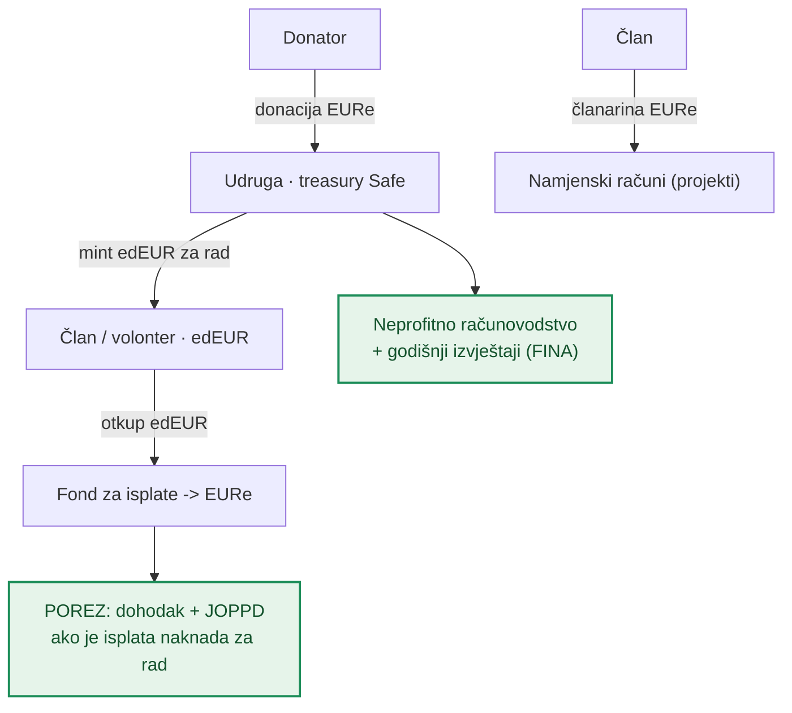
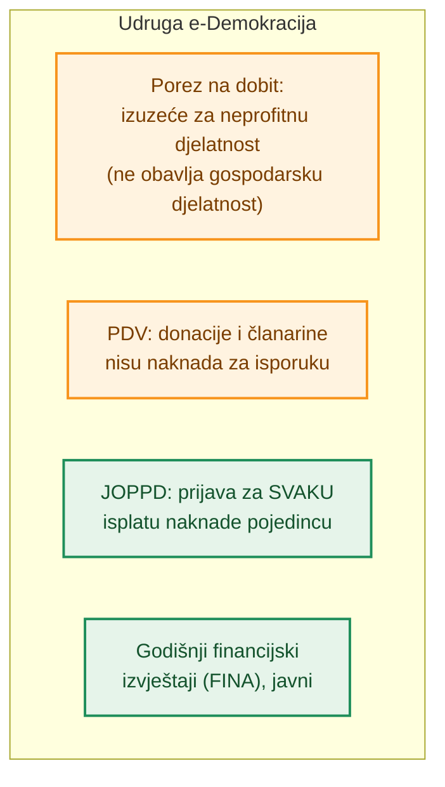
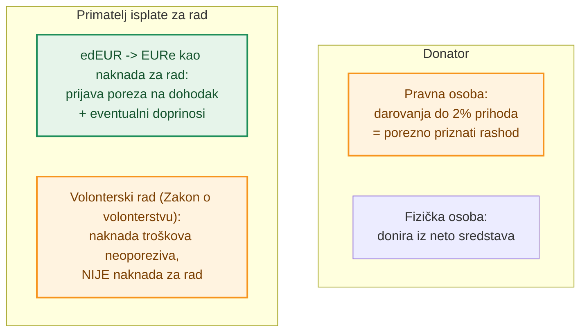
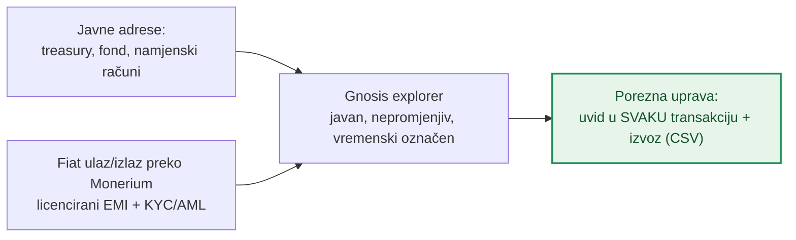

# Porezi i transparentnost — tok novca na javnom lancu

**Izdavatelj:** Udruga e-Demokracija · OIB 70011366813 · Remete 52, Zagreb
**Verzija:** nacrt 0.1 · **Datum:** 16. lipnja 2026.

> ⚠️ **Disclaimer.** Ovo je interna radna analiza, **ne porezni ni pravni savjet**. Konačnu poreznu kvalifikaciju daje knjigovođa / porezni savjetnik i, po potrebi, **obvezujuće mišljenje Porezne uprave**. Brojčani pragovi i stope mijenjaju se propisima — provjeriti aktualne vrijednosti prije primjene.

---

## 1. Vizija: transparentnost umjesto „crypto scama"

Blockchain se često percipira kao netransparentan ili sumnjiv. Kod nas je **suprotno**: ovo je **javna, nepromjenjiva baza podataka** u kojoj se svaka uplata i isplata vidi — bez skrivenih računa, bez gotovine, bez „muljanja".

Cilj je da sustav bude **najprijateljskiji moguć za Poreznu upravu**: svaka transakcija je javna, vremenski označena i provjerljiva, a porezne se obveze ne skrivaju nego se **jasno vide i uredno prijavljuju**. To je transparentnije od klasičnog bankovnog računa, jer cijeli tok novca može provjeriti bilo tko — uključujući poreznog inspektora — u svakom trenutku.

**Legenda boja u dijagramima:**
- 🟩 **zeleno** — točka u kojoj se **porez plaća ili prijavljuje**;
- 🟧 **narančasto** — **olakšica ili izuzeće** (porez se ne plaća, uz uvjete);
- ⬜ neutralno — uobičajeni tok sredstava.

---

## 2. Sudionici i javne adrese

Svi računi sustava su **javno objavljene adrese** na mreži Gnosis:

| Račun | Uloga | Vidljivost |
|---|---|---|
| **Treasury Safe udruge** | prima donacije i članarine | javna adresa, svaka uplata vidljiva |
| **Fond za isplate** | EURe za otkup edEUR / isplate | javna adresa |
| **Namjenski računi (projekti)** | sufinanciranje pojedinih projekata | javne adrese po projektu |

EURe je **regulirani token e-novca** koji izdaje licencirani izdavatelj (Monerium), pa ulaz i izlaz u „klasične" eure ide kroz **reguliranu instituciju uz KYC/AML** (banka ↔ IBAN ↔ EURe).

---

## 3. Tok novca i porezne točke

Svaka strelica je **stvarna transakcija na lancu** — javno provjerljiva. Zelene točke označavaju gdje nastaje porezna/prijavna obveza.

---

## 4. Porezi — Udruga (neprofitna organizacija)

- **Porez na dobit** — neprofitne organizacije načelno nisu obveznici za osnovnu (neprofitnu) djelatnost. Donacije i članarine nisu oporezivi prihod. *(Ako bi udruga obavljala gospodarsku djelatnost, Porezna uprava može rješenjem utvrditi obvezu za taj dio — udruga je deklarirala da ne obavlja gospodarsku djelatnost.)*
- **PDV** — donacije i članarine nisu naknada za isporuku dobara/usluga pa nisu predmet PDV-a; ulazak u sustav PDV-a dolazi u obzir tek ako oporezive isporuke prijeđu zakonski prag.
- **Računovodstvo** — neprofitno računovodstvo i **javni godišnji financijski izvještaji** (predaja FINA-i).
- **JOPPD** — za svaku isplatu naknade pojedincu udruga kao isplatitelj podnosi JOPPD obrazac.

---

## 5. Porezi — Pojedinac

- **Donator — pravna osoba:** darovanja u općekorisne svrhe priznaju se kao rashod **do 2 % prihoda prethodne godine** (Zakon o porezu na dobit).
- **Donator — fizička osoba:** donira iz vlastitih (neto) sredstava; općenito bez odbitka od poreza na dohodak.
- **Primatelj isplate za rad:** ⚠️ ovo je ključno. Ako se `edEUR` (potvrda rada) **otkupljuje za EURe kao naknada za rad**, ta je isplata vrlo vjerojatno **oporezivi dohodak** (npr. drugi dohodak / ugovor o djelu) → obračun poreza na dohodak i eventualnih doprinosa, uz JOPPD prijavu udruge. **Nije** isto što i neoporeziva **naknada troškova volonteru** po Zakonu o volonterstvu. Točnu kvalifikaciju (volontiranje / drugi dohodak / honorar) treba potvrditi s poreznim savjetnikom.

---

## 6. Najprijateljskije za Poreznu upravu — uvid onchain

Za poreznu reviziju ili nadzor dovoljno je otvoriti javne adrese u blockchain pregledniku:

- **svaka transakcija** je javna, vremenski označena i **nepromjenjiva** (ne može se naknadno „popraviti");
- **izvoz (CSV)** svih uplata/isplata po adresi za knjigovodstvo i poreznu provjeru;
- **fiat veza** (uplata/isplata u euro) ide kroz licenciranog izdavatelja e-novca uz KYC/AML, pa postoji uredan trag identiteta na on/off-rampi;
- za razliku od gotovine ili zatvorenih sustava, **ništa nije skriveno** — transparentnost je zadana, a ne iznimka.

---

## 7. Preporuke / sljedeći koraci

1. **Knjigovodstvo:** voditi neprofitno računovodstvo i povezivati onchain adrese s knjigovodstvenim stavkama (svaka tx → stavka).
2. **Porezna kvalifikacija isplata za rad:** prije prvih isplata `edEUR → EURe` zatražiti mišljenje poreznog savjetnika (i po potrebi Porezne uprave) o kvalifikaciji (volontiranje vs. dohodak) i obvezama (JOPPD, doprinosi).
3. **Objava adresa:** na mrežnoj stranici objaviti javne adrese sustava radi pune transparentnosti.
4. **Izvoz i revizija:** pripremiti standardni CSV izvoz transakcija za godišnje izvještaje i eventualni nadzor.

---

## Reference

- Zakon o porezu na dobit (RH) — neprofitne organizacije; darovanja do 2 % prihoda.
- Zakon o porezu na dohodak (RH) — dohodak, drugi dohodak, JOPPD.
- Zakon o porezu na dodanu vrijednost (RH) — prag i predmet oporezivanja.
- Zakon o financijskom poslovanju i računovodstvu neprofitnih organizacija (RH).
- Zakon o volonterstvu (RH) — naknada troškova volontera.
- Povezani interni dokumenti: [Uvjeti korištenja](./uvjeti-koristenja-novcanika.md) · [edEUR bilješka](./edeur-loyalty-token.md).

*Kraj nacrta. Sve tvrdnje podložne pravnoj i poreznoj potvrdi prije primjene.*
