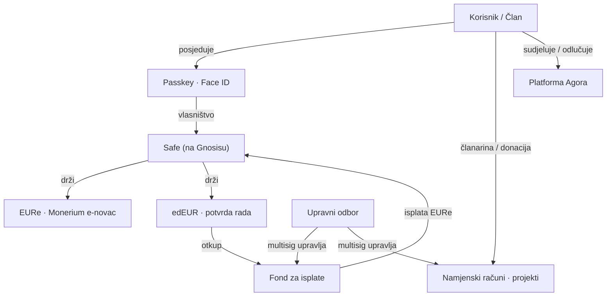
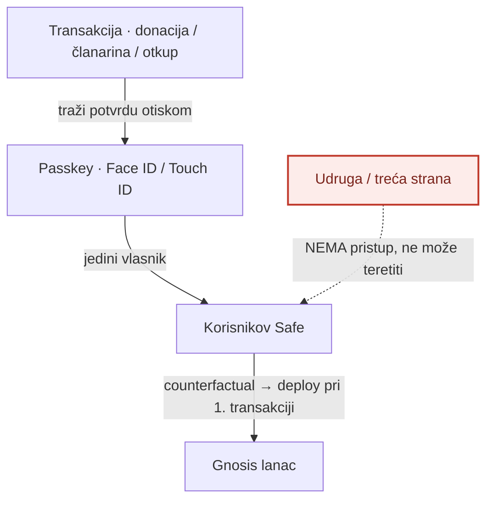
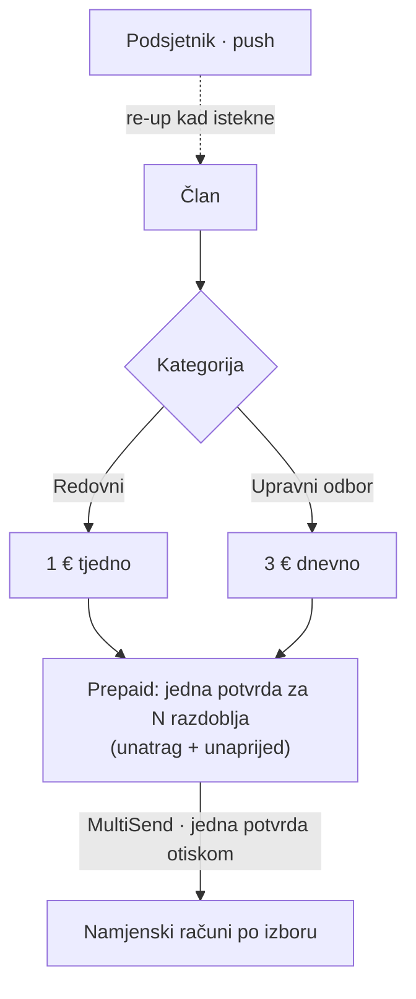
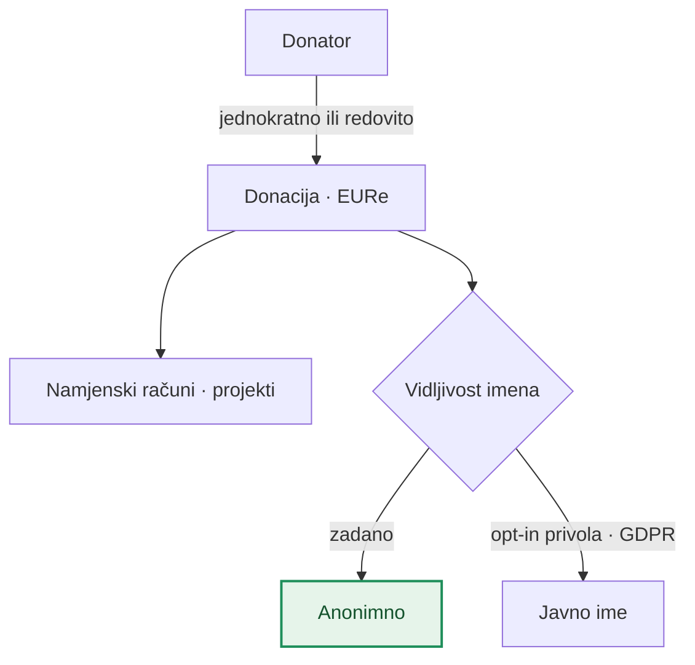
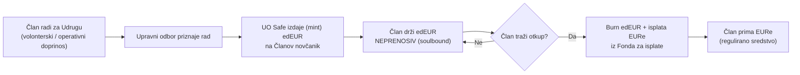
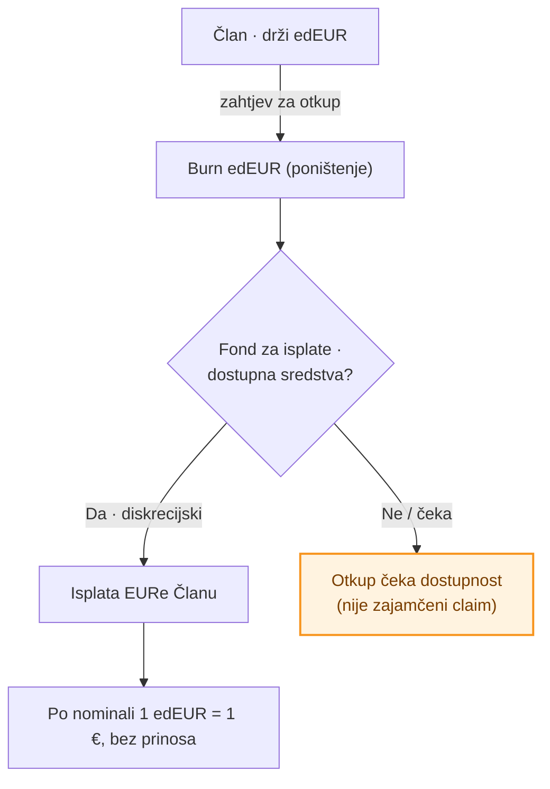
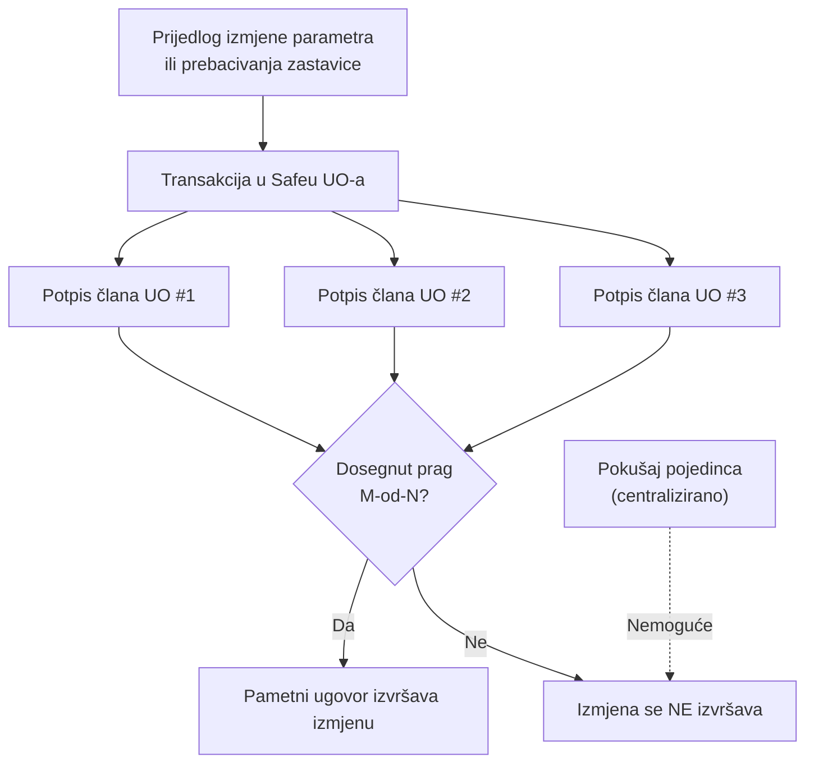
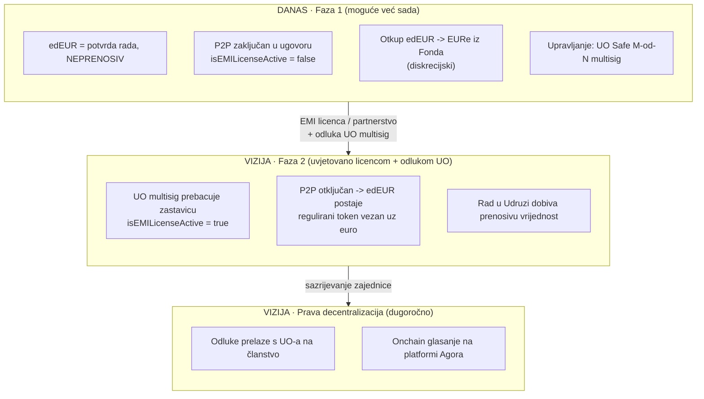

# Uvjeti korištenja — e-Demokracija novčanik

**Izdavatelj:** Udruga e-Demokracija
**OIB:** 70011366813 · **Registarski broj:** 21015383
**Sjedište:** Remete 52, 10000 Zagreb, Republika Hrvatska
**Mrežna stranica:** www.e-demokracija.hr · **E-pošta:** info@e-demokracija.hr

**Verzija:** nacrt 0.1 · **Datum:** 16. lipnja 2026.

> ⚠️ **Napomena.** Ovo je nacrt uvjeta korištenja pripremljen kao radni dokument. Prije objave i primjene mora ga potvrditi odvjetnik (područje fintech/MiCA i zaštita podataka). Dokument nije pravni savjet.

---

## 1. Uvodne odredbe

1.1. Ovim se Uvjetima uređuje korištenje aplikacije **e-Demokracija novčanik** (dalje: **Novčanik**), digitalne aplikacije koju izdaje Udruga e-Demokracija (dalje: **Udruga**) radi prikupljanja donacija, naplate članarina te priznavanja doprinosa članova zajednici.

1.2. Korištenjem Novčanika korisnik (dalje: **Član** ili **Korisnik**) potvrđuje da je pročitao, razumio i prihvatio ove Uvjete.

1.3. Misija Udruge je poticanje aktivnog sudjelovanja građana u demokratskim procesima, transparentnost i odgovornost. Novčanik je alat te misije, a ne sredstvo stjecanja dobiti.

---

## 2. Definicije

- **Novčanik** — samostalna (engl. *self-custody*) aplikacija u kojoj Korisnik isključivo sam upravlja svojim sredstvima putem privatnog ključa zaštićenog biometrijom (Face ID / Touch ID) i sustavom lozinki uređaja (engl. *passkey*). Udruga nema pristup sredstvima Korisnika.
- **Safe** — pametni ugovor novčanika (engl. *smart contract wallet*) na mreži **Gnosis**, čiji je vlasnik Korisnikov *passkey*.
- **EURe** — token elektroničkog novca vezan uz euro u omjeru 1:1, koji izdaje licencirana institucija za elektronički novac (Monerium). EURe je regulirano sredstvo i koristi se za stvarne uplate i isplate.
- **edEUR** — interni token Udruge koji služi kao **potvrda rada/doprinosa** Članu. edEUR **nije** elektronički novac, nije sredstvo plaćanja i nije investicija (v. poglavlje 6).
- **Članarina** — obvezni periodični doprinos Člana, plativ u EURe.
- **Namjenski račun** — zaseban Safe Udruge vezan uz pojedini projekt, na koji Član može usmjeriti članarinu ili donaciju.
- **Fond za isplate** — Safe Udruge u kojem se drže EURe namijenjeni otkupu edEUR.
- **Upravni odbor (UO)** — tijelo Udruge koje upravlja zajedničkim Safe novčanikom Udruge putem višestrukog potpisa (engl. *multisignature*).
- **Agora** — platforma Udruge za sudjelovanje i odlučivanje članova.

### Odnos entiteta

---

## 3. Novčanik i samostalno upravljanje (self-custody)

3.1. Novčanik je **100 % samostalan**: Korisnikov Safe u vlasništvu je njegova *passkeya*. Udruga, kao ni bilo koja treća strana, **ne može** raspolagati sredstvima Korisnika niti izvršiti transakciju bez Korisnikove potvrde biometrijom.

3.2. Svaka transakcija (donacija, članarina, otkup edEUR) izvršava se tek nakon Korisnikove **potvrde otiskom prsta / Face ID-em**.

3.3. Korisnik je **sam odgovoran** za pristup svom *passkeyu*. Gubitak svih pristupnih *passkeya* može značiti trajan gubitak pristupa sredstvima. Udruga ne može vratiti izgubljeni pristup umjesto Korisnika.

3.4. Sredstva (EURe) i zapisi (edEUR) nalaze se na javnoj mreži Gnosis i **javno su provjerljivi** (v. poglavlje 8).

### Tko može pristupiti sredstvima

---

## 4. Članstvo i članarina

4.1. **Kategorije i iznosi.** Aktivni član plaća članarinu od **1 € tjedno** uz prosječno **30 minuta tjedno** doprinosa Udruzi. Član Upravnog odbora plaća članarinu od **3 € dnevno**. Iznosi i kategorije utvrđeni su aktima Udruge (Statut, čl. 11) i mogu se mijenjati odlukom nadležnih tijela Udruge.

4.2. **Plaćanje unaprijed (engl. *set & forget*).** Član može jednom potvrdom platiti članarinu za više razdoblja unaprijed. Isto tako može podmiriti i neplaćena prošla razdoblja (unatrag).

4.3. **Usmjeravanje na namjenske račune.** Član nije obvezan članarinu uplatiti u jedinstveni središnji fond — može je **sam rasporediti** na jedan ili više namjenskih računa (projekata) Udruge prema vlastitom izboru. Time Novčanik funkcionira i kao interna platforma za sufinanciranje projekata zajednice.

4.4. **Jedinstvena potvrda.** Pri uplati na više namjenskih računa sve se uplate izvršavaju u **jednoj transakciji** uz jednu potvrdu otiskom prsta.

4.5. **Naplata u samostalnom novčaniku.** Budući da je Novčanik samostalan, ne postoji automatsko terećenje. Članarina se plaća: (a) unaprijed jednom potvrdom za više razdoblja, ili (b) na **podsjetnik** Udruge koji Član potvrđuje otiskom prsta. Udruga ne može teretiti Korisnikov Safe bez njegove potvrde.

### Članarina — kategorije i tok

---

## 5. Donacije

5.1. Donacije su dobrovoljne, jednokratne ili redovite, u EURe.

5.2. Donacije su prema zadanim postavkama **anonimne**; javno navođenje imena donatora moguće je isključivo uz izričitu privolu Člana (v. poglavlje 9).

5.3. Donacije se, kao i članarina, mogu usmjeriti na namjenske račune projekata.

### Tok donacije

---

## 6. edEUR — priroda, status i ograničenja

6.1. **Što je edEUR.** edEUR je interni token koji Udruga dodjeljuje Članu **kao potvrdu obavljenog rada/doprinosa** Udruzi. Jedan edEUR odgovara vrijednosti od 1 € isključivo kao **obračunska jedinica nagrade**.

6.2. **edEUR se ne kupuje.** edEUR se ne može kupiti za novac; nastaje isključivo izdavanjem (engl. *mint*) od strane Udruge na temelju priznatog rada.

6.3. **edEUR je neprenosiv.** Član **ne može** prenijeti edEUR drugom Članu ni bilo kojoj trećoj osobi. Pravo na prijenos (P2P) tehnički je onemogućeno na razini pametnog ugovora. edEUR je vezan uz Člana.

6.4. **edEUR nije novac ni investicija.** edEUR nije elektronički novac, nije sredstvo plaćanja na otvorenom tržištu, ne kotira na burzama, nema sekundarno tržište, ne nosi kamatu, prinos ni pravo na dobit. Njegova vrijednost ne može rasti iznad nominale.

6.5. **Pravni okvir.** Zbog svojstava iz točaka 6.2.–6.4. (neprenosivost, zatvoreni krug, nepostojanje tržišta) edEUR u trenutnoj fazi predstavlja **instrument programa lojalnosti zatvorenog kruga**, a ne token elektroničkog novca. Detaljna pravna analiza nalazi se u dokumentu [`edeur-loyalty-token.md`](./edeur-loyalty-token.md).

### Životni ciklus edEUR

---

## 7. Otkup edEUR za EURe

7.1. **Otkup iz Fonda za isplate.** Član može zatražiti zamjenu edEUR za EURe iz Fonda za isplate Udruge. Pri otkupu se edEUR poništava (engl. *burn*), a Udruga isplaćuje odgovarajući iznos u EURe.

7.2. **Diskrecijski karakter otkupa.** Otkup je **nagrada koja ovisi o dostupnosti sredstava u Fondu** i odlukama Udruge. edEUR **ne predstavlja zajamčeno potraživanje** na isplatu eura na zahtjev. Ova je odredba bitna za pravni status edEUR-a i ne smije se tumačiti kao obećanje isplate.

7.3. **Bez prinosa.** Otkup se obavlja po nominali 1 edEUR = 1 €; ne postoji prinos ni uvećanje vrijednosti.

### Tok otkupa edEUR → EURe

---

## 8. Transparentnost

8.1. Sve uplate i isplate (članarine, donacije, otkupi) javno su i nepromjenjivo zabilježene na mreži Gnosis te provjerljive svakom članstvu.

8.2. Identitet donatora nije javan osim uz izričitu privolu (poglavlje 9); javno je vidljiv **iznos i namjena**, sukladno načelu potpune transparentnosti Udruge.

---

## 9. Zaštita podataka (GDPR)

9.1. Udruga obrađuje osobne podatke u skladu s Općom uredbom o zaštiti podataka (GDPR) i propisima RH.

9.2. Donacije su prema zadanim postavkama **anonimne**. Javno navođenje imena moguće je samo na temelju izričite, dobrovoljne i opozive privole Člana.

9.3. Korisnik ima prava pristupa, ispravka, brisanja i prigovora sukladno GDPR-u; zahtjevi se upućuju na info@e-demokracija.hr.

---

## 10. Upravljanje izmjenama — višestruki potpis (decentralizacija)

10.1. **Zajednički Safe Udruge.** Treasury (riznicu) Udruge, Fond za isplate i parametre pametnih ugovora (uključujući pravila izdavanja edEUR-a) ne kontrolira nijedan pojedinac. Njima upravlja **Upravni odbor putem Safe novčanika s višestrukim potpisom (multisignature)** uz konfigurirani **prag potpisa M-od-N** (npr. 3 od 5 članova UO).

10.2. **Nijedna izmjena nije centralizirana.** Bilo koja izmjena parametara ili prebacivanje zastavica (v. poglavlje 11) može se izvršiti **isključivo** ako potreban broj članova UO potpiše transakciju. Pojedini član ne može sam izvršiti izmjenu.

10.3. **Pravičnost i provjerljivost.** Svako potpisivanje i svaka izmjena javno su zabilježeni na lancu, pa su odluke UO-a transparentne i provjerljive.

### Upravljanje izmjenom (M-od-N multisig)

---

## 11. Faze razvoja — danas i vizija

11.1. **Faza 1 (danas).** edEUR je neprenosivi instrument lojalnosti zatvorenog kruga. Pravo na P2P prijenos onemogućeno je u pametnom ugovoru (zastavica `isEMILicenseActive = false`). Novčanik gradi zajednicu, a edEUR priznaje rad njezinih članova.

11.2. **Faza 2 (vizija — uvjetovano).** Ako zajednica postane održiva i Udruga **ishodi licencu institucije za elektronički novac (EMI)** ili sklopi partnerstvo s licenciranim izdavateljem, Upravni odbor može **odlukom putem višestrukog potpisa** prebaciti zastavicu (`isEMILicenseActive = true`), čime se P2P prijenos otključava i edEUR može postati regulirani token vezan uz euro. Time rad uložen u Udrugu dobiva stvarnu, prenosivu vrijednost.

11.3. **Bez obećanja i bez očekivanja dobiti.** Prelazak u Fazu 2 **nije zajamčen** i ovisi o pravnim preduvjetima i odluci tijela Udruge. edEUR se ne smije stjecati s očekivanjem buduće dobiti; on je i ostaje potvrda rada. Sama zastavica ne stvara pravo na P2P — pravni temelj je licenca/partnerstvo.

11.4. **Prava decentralizacija (dugoročna vizija).** Dugoročno je cilj da odluke o parametrima i zastavicama prijeđu s Upravnog odbora na **šire članstvo**, kroz onchain glasanje na platformi Agora. Time se upravljanje pomiče od višestrukog potpisa UO-a prema izravnom odlučivanju zajednice.

### Što je moguće danas, a što je vizija

---

## 12. Rizici i odricanje od odgovornosti

12.1. **Samostalno upravljanje.** Korisnik je sam odgovoran za sigurnost svog *passkeya*. Gubitak pristupa može biti nepovratan.

12.2. **Tehnološki rizik.** Korištenje blockchain mreže nosi tehničke rizike (greške u ugovorima, zastoji mreže). Udruga ulaže razuman napor u sigurnost, ali ne jamči neprekidan rad.

12.3. **edEUR nije ulaganje.** edEUR ne nosi pravo na dobit ni povrat; ne smije se tumačiti kao financijski instrument.

12.4. Udruga ne odgovara za štetu nastalu zlouporabom uređaja Korisnika ili gubitkom pristupnih podataka koji su isključivo u Korisnikovoj domeni.

---

## 13. Završne odredbe

13.1. Na ove se Uvjete primjenjuje pravo Republike Hrvatske.

13.2. Udruga može izmijeniti Uvjete; o bitnim izmjenama Članovi će biti obaviješteni putem aplikacije ili e-pošte.

13.3. Za sva pitanja: **info@e-demokracija.hr**.

---

*Kraj nacrta. Sve odredbe podložne pravnoj potvrdi prije objave.*
